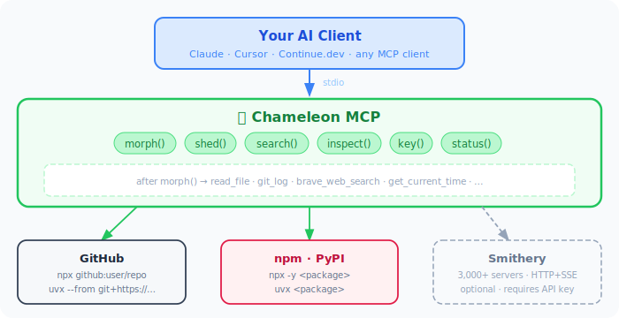

<div align="center">
  
  <h1>🦎 Chameleon MCP</h1>
  <p><strong>Find, try, and benchmark any MCP server in 2 minutes — without touching a config file.</strong></p>
</div>

[](https://pypi.org/project/chameleon-mcp/)
[](https://pypi.org/project/chameleon-mcp/)
[](https://github.com/kaiser-data/chameleon-mcp/actions)
[](LICENSE)
[](https://smithery.ai/server/@kaiser-data/chameleon-mcp)

**[→ 5-Minute Demo](examples/demo_wow.md)** — search, inspect, test, morph, benchmark, chain, token savings in one session.

---

## The Problem

There are thousands of MCP servers. You have no idea which ones are worth using.

Trying even one means: find it, figure out the install command, edit `mcp.json`, restart your client, use it for five minutes, then edit `mcp.json` again to remove it. One server. One at a time. No way to compare, measure, or discover alternatives mid-session.

So most people configure 2–3 servers once and never explore further. The ecosystem has thousands of servers, but the tooling makes evaluation impossible.

---

## What Chameleon MCP Does

Chameleon is a **single MCP server you configure once** that can become any other server on demand — and gives you tools to evaluate them properly.

```
search("web scraping")                            # find candidates across GitHub, npm, PyPI, Smithery
inspect("@modelcontextprotocol/server-puppeteer") # see tools + schema before committing
morph("@modelcontextprotocol/server-puppeteer")   # inject those tools live — no restart
puppeteer_navigate(url="https://example.com")     # use them exactly like native tools
bench("@modelcontextprotocol/server-puppeteer")   # measure p50/p95 latency and token cost
shed()                                            # clean removal when done
```

No config edits. No restarts. Search before you install, benchmark before you commit, swap without friction.

The key primitive is `morph()`: it downloads a server's tool definitions and registers them **directly onto Chameleon** via FastMCP's live tool API. Claude sees those tools exactly as if the server were configured natively — no wrapper, no indirection. `shed()` removes them cleanly.

---

## How It Fits Together

Chameleon acts as a **single, stable entry point** in your MCP config. Everything else is dynamic:

<div align="center">
  
</div>

This works because Chameleon uses FastMCP's live tool registration API — tools are added and removed from a running server at runtime, not at startup.

---

## Compatibility

Chameleon is a standard MCP server that speaks the [MCP protocol](https://modelcontextprotocol.io) over stdio. It works with **any AI client that supports MCP** — it is completely independent of which LLM or model backend you use.

### Supported AI clients

| Client | MCP support | Notes |
|--------|-------------|-------|
| [Claude Desktop](https://claude.ai/download) | ✅ Native | Add to `claude_desktop_config.json` |
| [Claude Code](https://github.com/anthropics/claude-code) | ✅ Native | Add to `.claude/mcp.json` |
| [Cursor](https://cursor.sh) | ✅ Native | Add to `.cursor/mcp.json` |
| [Continue.dev](https://continue.dev) | ✅ Native | Works with local Ollama models too |
| [Zed](https://zed.dev) | ✅ Native | Via MCP extension |
| [Open WebUI](https://openwebui.com) | ✅ Supported | Works with Ollama backend |
| Any custom agent | ✅ Via library | Use [`mcp`](https://pypi.org/project/mcp/) Python client or [`@modelcontextprotocol/sdk`](https://www.npmjs.com/package/@modelcontextprotocol/sdk) |

### What about Ollama, LM Studio, vLLM, and other local models?

Chameleon runs on the **tool side** of MCP, not the model side. It doesn't care which LLM is calling it.

- **Ollama** doesn't natively implement an MCP client, but [Continue.dev](https://continue.dev) + Ollama does — and Chameleon works with Continue.dev
- **LM Studio** has an OpenAI-compatible API; pair it with an MCP-capable client layer
- **vLLM / llama.cpp / any OpenAI-compatible server**: same — the client layer handles MCP, the model layer handles inference

If you're building a custom agent with Python, you can connect to Chameleon using the official [`mcp`](https://pypi.org/project/mcp/) library with any LLM backend:

```python
from mcp import ClientSession, StdioServerParameters
from mcp.client.stdio import stdio_client

# Chameleon MCP with any LLM — Ollama, OpenAI, Anthropic, local model
server_params = StdioServerParameters(command="chameleon-mcp")
async with stdio_client(server_params) as (read, write):
    async with ClientSession(read, write) as session:
        await session.initialize()
        tools = await session.list_tools()
```

---

## Quick Start

### 1. Install

```bash
pip install chameleon-mcp
```

### 2. Configure your MCP client

Add Chameleon **once, globally** — it will be available in every project and every session.

**Claude Desktop** — edit `~/Library/Application Support/Claude/claude_desktop_config.json` (macOS) or `%APPDATA%\Claude\claude_desktop_config.json` (Windows):

```json
{
  "mcpServers": {
    "chameleon": {
      "command": "chameleon-mcp"
    }
  }
}
```

**Claude Code** — edit `~/.claude/mcp.json` for global access across all projects:

```json
{
  "mcpServers": {
    "chameleon": {
      "command": "chameleon-mcp"
    }
  }
}
```

**Other clients** (Cursor, Continue.dev, Zed): add the same block to their respective MCP config file.

That's it — no API keys needed to start. Chameleon is now available in every session, in every project folder.

### 3. Use it

**From a GitHub repository (official MCP servers):**
```
morph("@modelcontextprotocol/server-filesystem")
read_file(path="/tmp/notes.txt")
shed()
```

**From an npm package:**
```
morph("@modelcontextprotocol/server-brave-search")
brave_web_search(query="MCP protocol 2025")
shed()
```

**From a GitHub repo directly:**
```
connect("uvx --from git+https://github.com/user/my-mcp-server my-server", name="myserver")
```

**With Smithery registry (optional — gives access to 3,000+ hosted servers):**
```
search("web search")          → find servers in registry
morph("exa/exa")              → take the form of Exa
web_search_exa(query="...")   → call the tool natively
shed()                        → return to base form
```

---

## Server Sources

Chameleon works with MCP servers from multiple sources — no single registry required.

### GitHub Repositories (recommended starting point)

Run any MCP server directly from a GitHub repository. This is ideal for:
- Official servers from the [`modelcontextprotocol`](https://github.com/modelcontextprotocol/servers) organization
- Community servers that haven't been published to a registry
- Your own servers under active development

```bash
# Via uvx (pip-based servers)
connect("uvx --from git+https://github.com/user/repo server-name", name="myserver")

# Via npx (npm-based servers, supports github: shorthand)
connect("npx github:user/repo", name="myserver")
```

The [official MCP servers repository](https://github.com/modelcontextprotocol/servers) contains reference implementations for filesystem, git, memory, databases, web search, and more — all runnable without a registry.

### npm Registry

Any npm package that follows the MCP server convention is supported natively:

```
morph("@modelcontextprotocol/server-filesystem")
morph("mcp-server-brave-search")
run("@modelcontextprotocol/server-memory", "create_entities", {...})
```

Search the npm registry without any authentication:
```
search("filesystem", registry="npm")
```

### Official MCP Registry

The [modelcontextprotocol/servers](https://github.com/modelcontextprotocol/servers) repository contains the reference implementations — always the safest starting point:

```
search("filesystem", registry="official")
morph("@modelcontextprotocol/server-filesystem")
read_file(path="/tmp/notes.txt")
shed()
```

These servers are available instantly without any API key, and Chameleon keeps its list fresh with a 24-hour cache of the GitHub directory.

### PyPI / pip Packages

Any pip-installable MCP server runs via `uvx`:

```
search("git", registry="pypi")
morph("mcp-server-git")
morph("mcp-server-sqlite")
run("uvx:mcp-server-time", "get_current_time", {})
```

### Smithery Registry (optional)

[Smithery](https://smithery.ai) is a curated registry of 3,000+ verified servers, including remotely hosted servers that run in the cloud without local installation.

To enable Smithery, add an API key (free at [smithery.ai/account/api-keys](https://smithery.ai/account/api-keys)):

```json
{
  "mcpServers": {
    "chameleon": {
      "command": "chameleon-mcp",
      "env": {
        "SMITHERY_API_KEY": "your-key-here"
      }
    }
  }
}
```

With Smithery enabled, `search()` includes verified registry results alongside npm results. Remote (cloud-hosted) servers can be called without any local installation.

**Without a Smithery key:** Chameleon is fully functional — you have access to the entire npm ecosystem, PyPI, and any GitHub repository. Smithery is a convenience layer, not a requirement.

---

## How It Works

### The morph pattern

Traditional MCP hubs route calls through a wrapper: `hub.call("exa", "web_search", args)`. Chameleon goes further — it **becomes** the server. After `morph()`, the server's tools are registered directly on Chameleon and callable by name with no extra layers.

```
Before morph():
  Claude → Chameleon (search, inspect, call, morph, shed, ...)

After morph("@modelcontextprotocol/server-filesystem"):
  Claude → Chameleon (search, inspect, call, morph, shed, ...,
                      read_file, write_file, list_directory, ...)
```

Your AI client sees the morphed tools exactly as if the server were configured directly. No prompt overhead, no tool-calling indirection.

### Transport selection

Chameleon picks the right transport automatically:

| Server source | Transport | How it runs |
|---|---|---|
| GitHub repo (npm) | Stdio | `npx github:user/repo` |
| GitHub repo (pip) | Stdio | `uvx --from git+https://github.com/...` |
| npm package | Stdio | Spawned locally via `npx` |
| pip package | Stdio | Spawned locally via `uvx` |
| Persistent server | Persistent Stdio | Long-lived process, reused across calls |
| Smithery remote server | HTTP+SSE | Remote call via `server.smithery.ai` (requires API key) |

### Persistent connections

Some servers — audio pipelines, hardware interfaces, stateful services — cannot cold-start on every tool call. `connect()` starts the process once and keeps it in a pool. The same process handles all subsequent calls until you explicitly `release()` it.

---

## Why Not Just X?

### "Can't I just add more servers to `mcp.json`?"

Yes — but every configured server starts at launch and exposes all its tools constantly. With 5+ servers you're sending hundreds of tool definitions on every request, which hurts response quality and burns tokens on tools your AI rarely needs. You also can't add or remove a server mid-session without editing the config file and restarting your client.

Chameleon's tool list stays minimal. Morph in what you need, shed it when you're done.

### "What about `mcp-dynamic-proxy`?"

[mcp-dynamic-proxy](https://pypi.org/project/mcp-dynamic-proxy/) solves the context-bloat problem differently: it hides all tools behind 3 meta-tools (`list_servers`, `list_tools`, `call_tool`). The trade-off is that your AI must *always* route calls through the wrapper — it never gets a native `web_search` tool, only ever `call_tool("brave", "web_search", {...})`.

Chameleon's approach is different: `morph()` **injects real tools directly into the session**. After `morph("mcp-server-brave-search")`, the AI sees and calls `brave_web_search` natively, with the actual schema, exactly as if the server were configured directly.

Two other gaps in mcp-dynamic-proxy:
- **Static config** — server list is defined in a JSON file at startup; no runtime discovery
- **No installation** — assumes all servers are already installed; can't resolve npm/PyPI/GitHub packages on demand

### "Can FastMCP do this natively?"

FastMCP provides the right primitives — `mcp.add_tool()`, `mcp.remove_tool()`, `mcp.mount()`, `FastMCPProxy` — but not a finished product. You'd need to wire up the rest yourself:

| | FastMCP native | Chameleon |
|---|:---:|:---:|
| Proxy a known HTTP/SSE server | ✅ | ✅ |
| Mount another server's tools at runtime | ✅ (write code) | ✅ `morph()` |
| Search registries to discover servers | ❌ | ✅ npm + Smithery |
| Install npm / PyPI / GitHub packages on demand | ❌ | ✅ |
| Atomic shed — retract all morphed tools at once | ❌ | ✅ `shed()` |
| Persistent stdio process pool | ❌ | ✅ |
| Zero boilerplate — works after `pip install` | ❌ | ✅ |

You [can build a subset of this](https://dev.to/amartyadev/building-a-dynamic-mcp-proxy-server-in-python-16jf) on top of FastMCP's `mcp.mount()`, but you'll still need to add package installation, registry search, subprocess lifecycle management, and the morph/shed snapshot concept. Chameleon is that work, pre-built and packaged.

---

## Installation Options

### From PyPI

```bash
pip install chameleon-mcp
```

### From source

```bash
git clone https://github.com/kaiser-data/chameleon-mcp
cd chameleon-mcp
pip install -e .
```

### Requirements

- Python 3.12+
- `node` / `npx` — required to run npm-based servers locally
- `uvx` (from [uv](https://github.com/astral-sh/uv)) — required to run pip-based servers locally

---

## Configuration

### Where to put the config

Configure Chameleon **globally** so it's available in every project — you only need to do this once.

| Client | Global config file |
|---|---|
| Claude Desktop (macOS) | `~/Library/Application Support/Claude/claude_desktop_config.json` |
| Claude Desktop (Windows) | `%APPDATA%\Claude\claude_desktop_config.json` |
| Claude Code | `~/.claude/mcp.json` |
| Cursor | `~/.cursor/mcp.json` |
| Continue.dev | `~/.continue/config.json` |

For project-specific overrides, place `mcp.json` inside your project's `.claude/` folder — it takes precedence over the global config for that project only.

### Minimal (no API keys)

```json
{
  "mcpServers": {
    "chameleon": {
      "command": "chameleon-mcp"
    }
  }
}
```

Works with all npm packages, pip packages, and GitHub repositories.

### With Smithery (optional)

```json
{
  "mcpServers": {
    "chameleon": {
      "command": "chameleon-mcp",
      "env": {
        "SMITHERY_API_KEY": "your-smithery-key"
      }
    }
  }
}
```

### Environment variables

| Variable | Required | Description |
|---|---|---|
| `SMITHERY_API_KEY` | No | Access to Smithery-hosted and verified servers. Free at [smithery.ai/account/api-keys](https://smithery.ai/account/api-keys). |

### Managing API keys safely

MCP servers run as subprocesses launched by your AI client — they don't inherit your interactive shell environment. This means `~/.zshrc` exports alone won't reach Chameleon. Here's the recommended setup:

**Keys needed at Chameleon startup** (e.g. `SMITHERY_API_KEY`) go in the `env` block of your MCP config — this is the only reliable way to pass them to the subprocess.

**All other keys** are best kept in a `~/.secrets` file and sourced from `~/.zshrc`:

```bash
# ~/.secrets  (chmod 600 — never commit this file)
export SMITHERY_API_KEY="your-key"
export OPENAI_API_KEY="your-key"
export ANTHROPIC_API_KEY="your-key"
```

```bash
# ~/.zshrc
[ -f ~/.secrets ] && source ~/.secrets
```

Add a global gitignore so secrets never accidentally get committed:

```bash
echo '.secrets\n.env\n.envrc' >> ~/.gitignore_global
git config --global core.excludesfile ~/.gitignore_global
```

**Keys for individual MCP servers** (Brave, Exa, etc.) don't need to be pre-configured at all — use the `key()` tool from inside your session:

```
key("EXA_API_KEY", "your-exa-key")
key("BRAVE_API_KEY", "your-brave-key")
```

This writes the value to `.env` in the current directory and loads it into the running process immediately. No restart needed. On the next session in the same project folder, Chameleon picks it up automatically.

---

## All Tools

### Discovery

| Tool | Description |
|---|---|
| `search(query, registry, limit)` | Search for MCP servers by task description. `registry` can be `"all"` (default), `"official"`, `"npm"`, `"smithery"`, or `"pypi"`. |
| `inspect(server_id)` | Show full details for a server: all tools with schemas, required credentials, connection type, and estimated token cost. |

### Execution

| Tool | Description |
|---|---|
| `call(server_id, tool, args, config)` | Call a single tool on any server without morphing. One-shot — no process is kept alive. |
| `run(package, tool, args)` | Run a tool from any npm or pip package by name. Supports `uvx:package-name` for pip packages. No registry lookup needed. |
| `auto(task, tool, args)` | Full pipeline in one call: search → pick best server → call tool. |
| `fetch(url, intent)` | Fetch a URL and return cleaned, compressed text (~17x smaller than raw HTML). |

### Shape-shifting

| Tool | Description |
|---|---|
| `morph(server_id, config)` | Take the form of a server — its tools are registered directly on Chameleon and callable by name. Replaces the current form if one is active. |
| `shed()` | Drop the current form and remove its tools. Returns to base Chameleon. |

### Persistent connections

| Tool | Description |
|---|---|
| `connect(command, name, inherit_stderr)` | Start a persistent MCP server process from any command. The process stays alive between calls. Probes for missing credentials and prints a setup guide if needed. |
| `release(name)` | Kill a persistent connection and free its resources. |
| `setup(name)` | Step-by-step configuration wizard for a connected server. Shows exactly what is missing and how to fix it. Call repeatedly until all requirements are satisfied. |

### Quality & benchmarking

| Tool | Description |
|---|---|
| `test(server_id, level)` | Run quality checks on a server and return a score from 0–100. Checks connectivity, tool schema validity, response format, and latency. |
| `bench(server_id, tool, args, n)` | Run a tool `n` times and return latency statistics: p50, p95, min, max. |

### Configuration

| Tool | Description |
|---|---|
| `key(env_var, value)` | Save an API key to `.env` permanently and load it into the current session immediately. |
| `skill(qualified_name)` | Fetch a Smithery skill prompt and inject it into context (requires Smithery key). |

### Status

| Tool | Description |
|---|---|
| `status()` | Show current form, active persistent connections, morphed tools, and token usage statistics. |

---

## Usage Examples

### Official MCP servers (no API key needed)

```
# Filesystem access
morph("@modelcontextprotocol/server-filesystem")
read_file(path="/tmp/notes.txt")
shed()

# Git operations
morph("@modelcontextprotocol/server-git")
git_log(repo_path="/path/to/repo", max_count=10)
shed()

# SQLite database
morph("mcp-server-sqlite")
read_query(query="SELECT * FROM users LIMIT 10")
shed()
```

### From a GitHub repository

```
# Run a server directly from GitHub (pip-based)
connect("uvx --from git+https://github.com/user/my-mcp-server my-server", name="dev")
setup("dev")            ← check for missing config
call("dev", "tool_name", {"arg": "value"})
release("dev")

# npm-based GitHub server
connect("npx github:user/my-npm-mcp-server", name="dev")
```

### Using the npm registry

```
search("web search", registry="npm")
morph("mcp-server-brave-search")
key("BRAVE_API_KEY", "your-key")    ← saved to .env, never needed again
brave_web_search(query="MCP protocol 2025")
shed()
```

### With Smithery (optional)

```
search("web search")          ← includes Smithery results when key is set
morph("exa/exa")
key("EXA_API_KEY", "your-key")
web_search_exa(query="MCP protocol 2025")
shed()
```

### Persistent server with setup guidance

```
connect("uvx voice-mode", name="voice")
# → ⚠️  Setup required before calling 'voice' tools:
# →   Missing env vars:
# →     key("DEEPGRAM_API_KEY", "<your-value>")
# → Call setup('voice') for step-by-step guidance.

setup("voice")                         ← shows next unresolved step
key("DEEPGRAM_API_KEY", "your-key")
setup("voice")                         ← confirms ready

morph("voice-mode")
speak(text="Hello from Chameleon!")
shed()
release("voice")
```

### Run without morphing

```
call("@modelcontextprotocol/server-filesystem", "read_file", {"path": "/tmp/test.txt"})
run("uvx:mcp-server-time", "get_current_time", {})
```

---

## Architecture

```
Claude / AI Agent
       │
       ▼
  Chameleon MCP (server.py — entry point)
       │
       ├── chameleon_mcp/
       │     ├── registry.py         ── MultiRegistry → OfficialMCPRegistry, SmitheryRegistry, NpmRegistry, PyPIRegistry
       │     ├── official_registry.py── reference servers from modelcontextprotocol/servers (seed + GitHub API)
       │     ├── transport.py        ── HTTPSSETransport, StdioTransport, PersistentStdioTransport
       │     ├── morph.py            ── live tool registration via FastMCP.add_tool / remove_tool
       │     ├── probe.py            ── env var detection, OAuth, schema creds, setup guide generation
       │     ├── credentials.py      ── .env I/O, config resolution
       │     └── tools.py            ── all 16 @mcp.tool() definitions
       │
       ├── OfficialMCPRegistry ──► github.com/modelcontextprotocol/servers  (no auth, 24h cache)
       ├── GitHub repos        ──► npx github:user/repo  /  uvx --from git+https://...
       ├── NpmRegistry         ──► registry.npmjs.org  (no auth required)
       ├── PyPIRegistry        ──► pypi.org  (no auth required)
       └── SmitheryRegistry    ──► registry.smithery.ai  (optional, requires API key)
```

---

## Roadmap

- [x] Search across npm + Smithery
- [x] morph() / shed() — live tool registration
- [x] HTTP+SSE transport for Smithery-hosted servers
- [x] Stdio transport for local npm/pip servers
- [x] Persistent process pool — connect() / release()
- [x] test() quality scoring (0–100)
- [x] bench() latency benchmarking
- [x] setup() step-by-step configuration wizard
- [x] Readiness probe: env vars, OAuth, schema credentials, local URL reachability
- [x] Official MCP registry integration ([modelcontextprotocol/servers](https://github.com/modelcontextprotocol/servers))
- [x] PyPI registry search (`search(registry="pypi")`)
- [x] Server health monitoring in `status()` (ping + token savings vs always-on)
- [ ] GitHub repo as a first-class `server_id` (`github:user/repo`)
- [ ] WebSocket transport

---

## Contributing

```bash
git clone https://github.com/kaiser-data/chameleon-mcp
cd chameleon-mcp
make dev     # install with dev dependencies
make test    # run the test suite (pytest)
make lint    # ruff check
```

See [CONTRIBUTING.md](CONTRIBUTING.md) for tool patterns, commit style, and PR checklist.

Issues and PRs: [github.com/kaiser-data/chameleon-mcp](https://github.com/kaiser-data/chameleon-mcp)

---

*MIT License · Python 3.12+ · Built on [FastMCP](https://github.com/jlowin/fastmcp)*
