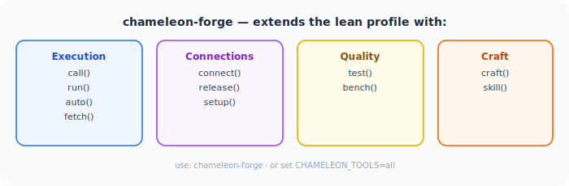

<div align="center">
  
  <h1>🦎 Chameleon MCP</h1>
  <p><strong>The dynamic MCP hub — morph into any server at runtime.<br/>Built for adaptive agents and MCP developers alike.</strong></p>
</div>

[](https://pypi.org/project/chameleon-mcp/)
[](https://pypi.org/project/chameleon-mcp/)
[](https://github.com/kaiser-data/chameleon-mcp/actions)
[](LICENSE)
[](https://smithery.ai/server/@kaiser-data/chameleon-mcp)

---

## A new way to use MCP

MCP has so far been mostly static — configure servers at startup, all tools loaded forever, restart required for any change. Chameleon changes that.

**One entry in your config. Any server, on demand, at runtime.**

```
search("web scraping")                            # discover
morph("@modelcontextprotocol/server-puppeteer")   # inject tools live — no restart
puppeteer_navigate(url="https://example.com")     # call them natively
shed()                                            # clean exit
```

`morph()` registers a server's tools directly via FastMCP's live API — no wrapper, no indirection, no config edit. `shed()` removes them cleanly. The whole session costs **7 tools and ~650 tokens overhead** ([measured](examples/benchmark.py)).

Need only specific tools? Lean morph keeps overhead surgical:
```
morph("@modelcontextprotocol/server-filesystem", tools=["read_file", "write_file"])
# only 2 tools appear instead of 10
```

---

## Built for two audiences

### Adaptive agents

An agent that loads all tools upfront burns tokens and flexibility. An agent that morphs on demand stays lean and adaptable:

- `morph()` switches the entire capability set in one call — ~650 tokens, no restart
- Acquire a tool for the current task, shed it, acquire the next
- Chain across multiple servers in one session without touching config
- `morph(server_id, tools=[...])` for surgical selection — only the tools actually needed

Chameleon is designed around the token budget of a real agent loop.

### MCP developers

Beyond MCP Inspector's basic schema viewer, Chameleon gives you a full development workflow inside your actual AI client:

| Need | Tool |
|---|---|
| Explore a server's tools and schemas | `inspect(server_id)` |
| Quality-score your server end-to-end | `test(server_id)` → score 0–100 |
| Benchmark tool latency | `bench(server_id, tool, args)` → p50, p95, min, max |
| Prototype endpoint-backed tools live | `craft(name, description, params, url)` |
| Test inside real Claude/Cursor workflows | `morph()` → call tools natively → `shed()` |
| Compare two servers side by side | morph one, test, shed, morph the other |

No separate web UI. No isolated test environment. Test how your server actually behaves when an AI uses it.

---

## Two modes

| | `chameleon-mcp` | `chameleon-forge` |
|---|---|---|
| **Purpose** | Adaptive agents, everyday morphing | MCP evaluation, benchmarking, crafting |
| **Tools** | 7 (morph, shed, search, inspect, call, key, status) | All 17 |
| **Token overhead** | ~650 tokens | ~1,700 tokens |
| **Use when** | Agents morphing per task, minimal token budget | Discovering, testing, benchmarking, prototyping |

> Token numbers are measured from actual registered schemas — see [examples/benchmark.py](examples/benchmark.py).

Both modes from the same package:

```json
{ "command": "chameleon-mcp" }                        ← lean (default)
{ "command": "chameleon-forge" }                      ← full suite
{ "command": "chameleon-mcp",
  "env": { "CHAMELEON_TOOLS": "morph,shed,key" } }    ← custom
```

---

## How It Fits Together

<div align="center">
  
</div>

`morph()` injects tools directly at runtime via FastMCP's live API. Token overhead stays flat regardless of how many servers you explore.

Need the full evaluation suite? `chameleon-forge` adds execution, connection management, benchmarking, and tool crafting:

<div align="center">
  
</div>

---

## Quick Start

```bash
pip install chameleon-mcp
```

Add to your MCP client config — **once, globally**:

```json
{
  "mcpServers": {
    "chameleon": {
      "command": "chameleon-mcp"
    }
  }
}
```

Works with Claude Desktop, Claude Code, Cursor, Cline, OpenClaw, Continue.dev, Zed, and any MCP-compatible client. No API keys needed.

| Client | Global config file |
|---|---|
| Claude Desktop (macOS) | `~/Library/Application Support/Claude/claude_desktop_config.json` |
| Claude Desktop (Windows) | `%APPDATA%\Claude\claude_desktop_config.json` |
| Claude Code | `~/.claude/mcp.json` |
| Cursor / Windsurf | `~/.cursor/mcp.json` |
| Cline / Continue.dev | VS Code settings / `~/.continue/config.json` |
| OpenClaw | MCP config in OpenClaw settings |

---

## Server Sources

Chameleon searches across multiple registries — no single one required.

| Registry | Auth | `registry=` value |
|---|---|---|
| [modelcontextprotocol/servers](https://github.com/modelcontextprotocol/servers) | None | `official` |
| [registry.modelcontextprotocol.io](https://registry.modelcontextprotocol.io) | None | `mcpregistry` |
| [Glama](https://glama.ai/mcp/servers) | None | `glama` |
| [npm](https://npmjs.com) | None | `npm` |
| [PyPI](https://pypi.org) | None | `pypi` |
| GitHub repos | None | `github:owner/repo` |
| [Smithery](https://smithery.ai) | Free API key | `smithery` |

Default `search()` fans out across all no-auth registries automatically. Add a `SMITHERY_API_KEY` to include Smithery's 3,000+ verified servers.

---

## How It Works

### The proxy model

Chameleon is a **dynamic MCP proxy**. It sits between your AI client and any number of other MCP servers, connecting to them on demand:

```
Your AI client
    │
    ▼
Chameleon MCP          ← the one entry in your config
    │
    ├── (on morph) ──► filesystem server   (spawned subprocess)
    ├── (on morph) ──► brave-search server (spawned subprocess)
    └── (on morph) ──► remote HTTP server  (HTTP+SSE connection)
```

**Nothing is copied.** When you call a morphed tool, Chameleon forwards the call to the original server via JSON-RPC and returns the result. The server's logic always runs on the server — Chameleon only relays the schema and the call.

### What morph() does, step by step

1. **Connects** to the target server via the right transport (stdio subprocess, HTTP, WebSocket)
2. **Handshakes** — sends MCP `initialize` / `notifications/initialized`
3. **Fetches** `tools/list`, `resources/list`, `prompts/list` from the server
4. **Registers** each tool as a native FastMCP tool — a proxy closure with the exact signature from the schema
5. **Notifies** the AI client (`notifications/tools/list_changed`) so the new tools appear immediately

The AI sees `read_file`, `write_file`, `list_directory` as if they were always there. There's no wrapper or `call_tool("filesystem", ...)` indirection — the tools are first-class.

`shed()` reverses all of it: deregisters the proxy closures, clears resources and prompts, notifies the client.

### Resources and prompts

`morph()` proxies all three MCP primitives, not just tools:

| Primitive | What gets proxied |
|---|---|
| **Tools** | Every tool from `tools/list`, registered with its exact parameter schema |
| **Resources** | Static resources from `resources/list` — readable via the MCP resources API |
| **Prompts** | Every prompt from `prompts/list`, with its argument signature |

Template URIs (e.g. `file:///{path}`) are skipped — they require parameter binding that adds complexity with little practical gain. Everything else is proxied.

### Transport is automatic

| Server source | How it runs |
|---|---|
| npm package | `npx <package>` — spawned locally |
| pip package | `uvx <package>` — spawned locally |
| GitHub repo | `npx github:user/repo` or `uvx --from git+https://...` |
| Docker image | `docker run --rm -i --memory 512m <image>` |
| Smithery remote | HTTP+SSE via `server.smithery.ai` (requires API key) |
| WebSocket server | `ws://` / `wss://` |

### Why inspect() before morph()

`inspect()` connects to the server and fetches its schemas — but does **not** register anything. Zero tools added to context, zero tokens consumed by the AI.

Use it to:
- See exact parameter names and types before committing
- Check credential requirements upfront (avoid a cryptic error mid-task)
- Get the measured token cost of the morph so you can budget
- Verify the server actually starts and responds before a live session

```
inspect("mcp-server-brave-search")
# → CREDENTIALS
# →   ✗ missing  BRAVE_API_KEY — Brave Search API key
# →   Add to .env:  BRAVE_API_KEY=your-value
# → Token cost: ~99 tokens (measured)

# Add the key to .env — picked up immediately, no restart needed
# Then morph and use in the same session:
morph("mcp-server-brave-search")
call("brave_web_search", arguments={"query": "MCP protocol 2025"})
```

---

## Security

Chameleon introduces a trust model for servers you haven't personally audited.

### Trust tiers

Every `morph()`, `call()`, and `connect()` result shows where the server comes from:

| Tier | Sources | Indicator |
|---|---|---|
| High | `official` (modelcontextprotocol/servers) | `✓ Source: official` |
| Medium | `mcpregistry`, `glama`, `smithery` | `✓ Source: smithery` |
| Community | `npm`, `pypi`, `github` | `⚠️ Source: npm (community — not verified)` |

### Install command validation

Before spawning any subprocess, Chameleon validates the executable name:
- Blocks shell metacharacters (`&`, `;`, `|`, `` ` ``, `$`) — prevents injection via a crafted server ID
- Blocks path traversal (`../`) — prevents escaping to arbitrary binaries

Arguments are passed directly to `asyncio.create_subprocess_exec` (never a shell), so they are not subject to shell interpretation.

### Credential warnings

`morph()` probes tool descriptions for unreferenced environment variable patterns. If a tool mentions `BRAVE_API_KEY` and that variable isn't set, you get a warning immediately — before you call anything:

```
⚠️  Credentials may be required — add to .env:
  BRAVE_API_KEY=your-value
  Or: key("BRAVE_API_KEY", "your-value")
```

### Process isolation and sandboxing

- stdio servers run as separate OS processes — no shared memory with Chameleon
- Docker servers run with `--rm -i --memory 512m --label chameleon-mcp=1`
- `fetch()` blocks private IPs, loopback, and non-HTTPS URLs (SSRF protection)
- The process pool has a hard cap of 10 concurrent processes and evicts idle ones after 1 hour

---

## What You Can Access

One `chameleon-mcp` entry unlocks any of these on demand — no config changes, no restart:

| Category | Servers | Key needed | Lean tokens |
|---|---|---|---|
| **Web search** | Brave Search, Exa, Linkup, Parallel | Free API keys | ~150–993 |
| **Web scraping** | Firecrawl, ScrapeGraph AI | Free tiers | ~400 (lean) |
| **Code & repos** | GitHub (official, 26 tools) | Free GitHub token | ~500 (lean) |
| **Productivity** | Notion, Linear, Slack | Free workspace keys | ~400 (lean) |
| **Google** | Maps, Calendar, Gmail, Drive | Free GCP key / OAuth | varies |
| **Memory** | Mem0, knowledge graphs | Free tiers | ~300 |
| **No key required** | Filesystem, Git, weather, Yahoo Finance | — | ~300–1,000 |

The same pattern works for all of them:
```
morph("brave")                                    # web search in 2 tools
call("brave_web_search", arguments={"query": "…"})

morph("firecrawl-mcp", tools=["scrape","search"]) # scraping, lean (2 of 9 tools)
call("scrape", arguments={"url": "https://…"})

morph("@modelcontextprotocol/server-github", tools=["create_issue","search_repositories"])
call("create_issue", arguments={"owner": "…", "repo": "…", "title": "…"})
```

**Token cost scales with what you load**, not what exists. A 26-tool GitHub server costs ~500 tokens if you only morph 3 tools. See [.env.example](.env.example) for the full key catalog with lean morph hints.

### Security note on `.env`

Chameleon re-reads `.env` on every call — which means adding a key instantly activates it. That convenience comes with a responsibility: **`.env` is the single place all your API keys live**. A few practices worth following:

- Add `.env` to `.gitignore` — never commit real keys
- Use project-level `.env` for project-specific keys; `~/.chameleon/.env` for personal global keys
- Prefer minimal OAuth scopes and fine-grained tokens (e.g. GitHub fine-grained tokens with per-repo permissions)
- Rotate keys that get exposed; Chameleon picks up the new value immediately without restart

---

## Why Not Just X?

**"Can't I just add more servers to `mcp.json`?"** — Every configured server starts at launch and exposes all tools constantly. You can't add or remove mid-session without a restart. With 5+ servers you're burning thousands of tokens on every request for tools rarely needed. Chameleon keeps the tool list minimal — morph in what you need, shed it when done.

**"What about MCP Inspector?"** — MCP Inspector is a standalone web UI that connects to one server and lets you inspect schemas and call tools manually. It's useful for basic debugging but isolated from real AI workflows. Chameleon tests servers inside actual Claude or Cursor sessions — how an AI really uses them. It adds `test()` scoring, `bench()` latency numbers, side-by-side server comparison, and `craft()` for live endpoint prototyping. It also discovers and installs servers on demand; Inspector requires you to already have one running.

**"What about `mcp-dynamic-proxy`?"** — It hides tools behind `call_tool("brave", "web_search", {...})` — always a wrapper. After `morph("mcp-server-brave-search")`, Chameleon gives you a real native `brave_web_search` with the actual schema. It also can't discover or install packages at runtime.

**"Can FastMCP do this natively?"**

| | FastMCP native | Chameleon |
|---|:---:|:---:|
| Proxy a known HTTP/SSE server | ✅ | ✅ |
| Mount tools at runtime | ✅ (write code) | ✅ `morph()` |
| Search registries to discover servers | ❌ | ✅ npm · official · Glama · Smithery |
| Install npm / PyPI / GitHub packages on demand | ❌ | ✅ |
| Atomic shed — retract all morphed tools at once | ❌ | ✅ `shed()` |
| Persistent stdio process pool | ❌ | ✅ |
| Zero boilerplate — works after `pip install` | ❌ | ✅ |

---

## Configuration

### Minimal (no API keys)

```json
{
  "mcpServers": {
    "chameleon": { "command": "chameleon-mcp" }
  }
}
```

### With Smithery (optional)

```json
{
  "mcpServers": {
    "chameleon": {
      "command": "chameleon-mcp",
      "env": { "SMITHERY_API_KEY": "your-key" }
    }
  }
}
```

Get a free key at [smithery.ai/account/api-keys](https://smithery.ai/account/api-keys). Without it, Chameleon is fully functional via npm, PyPI, official registries, and GitHub.

**Frictionless credentials** — Chameleon re-reads `.env` on every `inspect()`, `morph()`, and `call()`. Add a key mid-session and it takes effect immediately — no restart:

```
# .env (CWD, ~/.env, or ~/.chameleon/.env — all checked, CWD wins)
BRAVE_API_KEY=your-key
GITHUB_TOKEN=ghp_...
```

Or use `key()` to write to `.env` and activate in one step:

```
key("BRAVE_API_KEY", "your-key")   # writes to .env, active immediately
```

---

## All Tools

### `chameleon-mcp` — lean profile (7 tools, ~650 token overhead)

| Tool | Description |
|---|---|
| `morph(server_id, tools)` | Inject a server's tools live. `tools=[...]` for lean morph. |
| `shed(release)` | Remove morphed tools. `release=True` kills the process immediately. |
| `search(query, registry)` | Search MCP servers across registries. |
| `inspect(server_id)` | Show tools, schemas, and live credential status (✓/✗ per key). |
| `call(tool_name, server_id, args)` | Call a tool. `server_id` optional when morphed — current form used. |
| `key(env_var, value)` | Save an API key to `.env` and load it immediately. |
| `status()` | Show current form, active connections (PID + RAM), token stats. |

### `chameleon-forge` — full suite (all 17 tools, ~1,700 token overhead)

Everything above, plus:

| Tool | Description |
|---|---|
| `call(tool_name, server_id, args)` | Already in lean profile — listed here for completeness. |
| `run(package, tool, args)` | Run from npm/pip directly. `uvx:pkg-name` for Python. |
| `auto(task, tool, args)` | Search → pick best server → call in one step. |
| `fetch(url, intent)` | Fetch a URL, return compressed text (~17x smaller than raw HTML). |
| `craft(name, description, params, url)` | Register a custom tool backed by your HTTP endpoint. `shed()` removes it. |
| `connect(command, name)` | Start a persistent server. Accepts server_id or shell command. |
| `release(name)` | Kill a persistent connection by name. |
| `setup(name)` | Step-by-step setup wizard for a connected server. |
| `test(server_id, level)` | Quality-score a server 0–100. |
| `bench(server_id, tool, args)` | Benchmark tool latency — p50, p95, min, max. |
| `skill(qualified_name)` | Load a skill into context. Persisted across sessions. |

---

## Usage Examples

### Adaptive agent — multi-server session, zero config

```
# Task 1: read some files
morph("@modelcontextprotocol/server-filesystem", tools=["read_file"])
read_file(path="/tmp/data.csv")
shed()

# Task 2: search the web
morph("mcp-server-brave-search")
brave_web_search(query="latest MCP servers 2025")
shed()

# Task 3: run a git query
morph("@modelcontextprotocol/server-git", tools=["git_log"])
git_log(repo_path=".", max_count=5)
shed()
# Three different servers. One session. Zero config edits.
```

### MCP developer workflow — test your server

```
# Evaluate your server before publishing
inspect("my-server")               # review schemas and credentials
test("my-server")                  # quality score 0–100
bench("my-server", "my_tool", {})  # p50, p95 latency

# Prototype a tool backed by your local endpoint
craft(
    name="my_tool",
    description="Calls my ranking service",
    params={"query": {"type": "string"}},
    url="http://localhost:8080/rank"
)
my_tool(query="test")   # call it natively inside Claude
shed()
```

### Same-session usage with call()

After `morph()`, use `call()` immediately — no restart, no server_id needed:

```
morph("@modelcontextprotocol/server-filesystem")
# → "In this session: call('tool_name', arguments={...})"

call("list_directory", arguments={"path": "/Users/me/project"})
call("read_file", arguments={"path": "/Users/me/project/README.md"})
shed()
```

### Search, morph, use, shed

```
search("web search")
morph("mcp-server-brave-search")
key("BRAVE_API_KEY", "your-key")   # picked up immediately
call("brave_web_search", arguments={"query": "MCP protocol 2025"})
shed()
```

### Persistent server with setup guidance

```
connect("uvx voice-mode", name="voice")
setup("voice")                      # shows missing env vars
key("DEEPGRAM_API_KEY", "your-key")
setup("voice")                      # confirms ready
morph("voice-mode")
speak(text="Hello from Chameleon!")
shed(release=True)                  # kills process, frees RAM
```

---

## Installation

```bash
pip install chameleon-mcp        # from PyPI
# or
git clone https://github.com/kaiser-data/chameleon-mcp && pip install -e .
```

**Requirements:** Python 3.12+ · `node`/`npx` (for npm servers) · `uvx` from [uv](https://github.com/astral-sh/uv) (for pip servers)

---

## Contributing

```bash
make dev     # install with dev dependencies
make test    # pytest
make lint    # ruff
```

Issues and PRs: [github.com/kaiser-data/chameleon-mcp](https://github.com/kaiser-data/chameleon-mcp)

---

*MIT License · Python 3.12+ · Built on [FastMCP](https://github.com/jlowin/fastmcp)*
